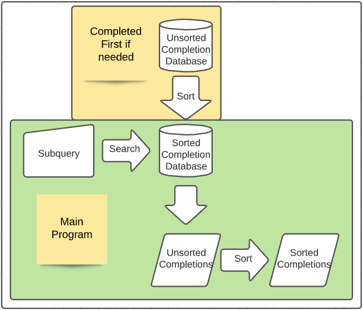
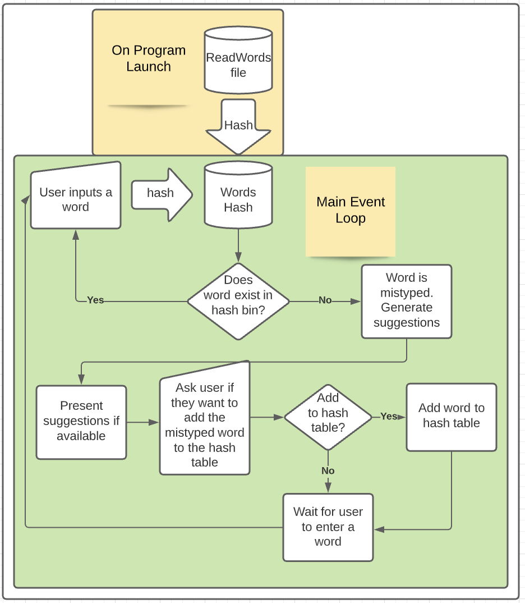

# CS 260 Data Structures - Programming Assignments

| Author | Email |
| ------ | ----- |
| Jack McVeigh | <jmcveigh5@gmail.com> |

## Purpose
Explore and implement various data structures and algorithms.

## Projects (Order of Completion)
* ***Autocomplete***

>| Algorithms Used | Data Structures Used |
>| --------------- | -------------------- |
>| Bubble Sort | Linked List |
>| Binary Sort |  |

* ***Spell Check***
  * Focuses on implementing DS with minimum time complexity

>| Algorithms Used | Data Structures Used |
>| --------------- | -------------------- |
>|  | Hash Table |
>|  | Linked List |

* ***Huffman Encoding***
  * Focuses on implementing DS with minimum time complexity

>| Algorithms Used | Data Structures Used |
>| --------------- | -------------------- |
>|  | Hash Table |
>|  | Min-Heap (Priority Queue) |
>|  | Binary Search Tree |

* ***Sliding Puzzle***

>| Algorithms Used | Data Structures Used |
>| --------------- | -------------------- |
>| Depth First Search | Graph |
>| Breadth First Search | Min-Heap |

* ***Sliding Puzzle (with heuristics)***

>| Algorithms Used | Data Structures Used |
>| --------------- | -------------------- |
>| Depth First Search | Graph |
>| Breadth First Search | Min-Heap |
>| Manhattan Distance |  |
